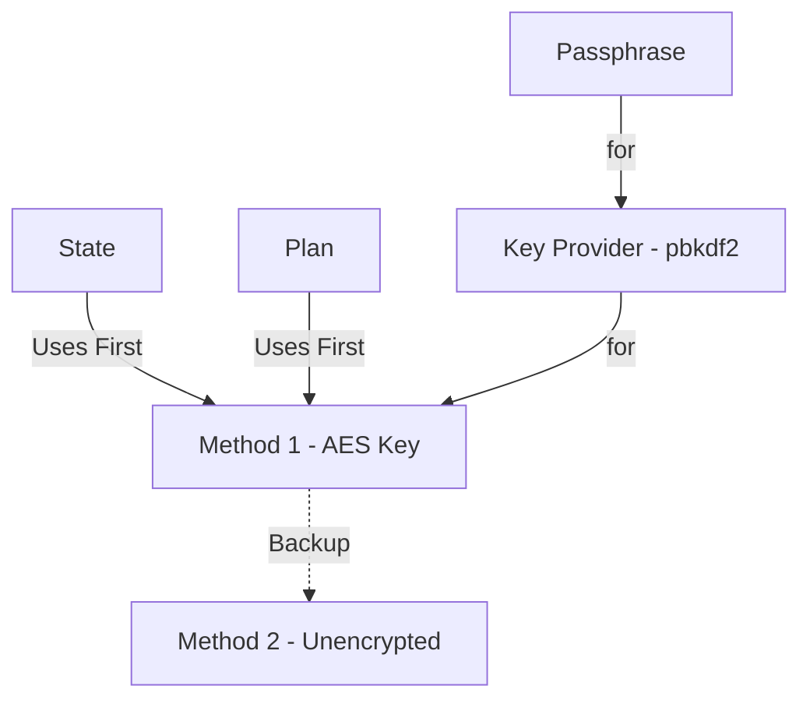
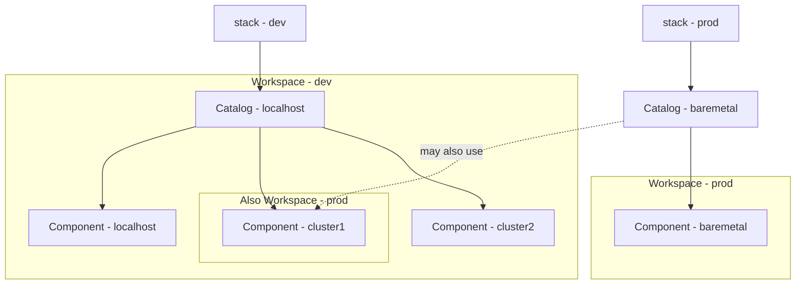

# OpenTofu State Encryption + Atmos

An example of using [opentofu](https://opentofu.org/)'s encrypted state with atmos to bring up and down your environment in an entirely self-contained manner.

The result of this will be a set of 2 local kind kubernetes clusters along with localized/encrypted state suitable for storing in git.

# Requirements

To use this project, you need to have the following requirements met:

1. **Mise**: Ensure you have [mise](https://mise.jdx.dev/) activated in your terminal. Mise is a tool that helps manage your development environment on a per-folder basis. This is incredibly useful for polyglot coding like this particular example. I find it to be less overhead than devcontainers. It does not replace virtual environments but can augment your use of them. It als replaces direnv for automatic loading of variables and secrets and more.

2. Docker/containerd

3. Linux/osx

**NOTE** Make sure to have mise activated before running the script to avoid any issues.

# Using

**configure.sh**: Run the `configure.sh` script to set up your environment. This script will configure necessary dependencies and settings for the project.

```sh
./configure.sh
# Use this for further tasks if not already in your profile
eval "$(mise activate bash)"
```

Run `task` at any time to see a list of additional tasks. For this example most tasks are at the root `Taskfile.yml` manifest.

## Master Key

The all the secrets for this project distill into one age private key that you will maintain and secure in a manner you are happy with on your end. I would recommend backing it up to an encrypted database like keepass or similar. You can automate the creation of a new key file at `~/.config/sops/age/keys.txt` with the following command (will not overwrite if exists).

```bash
task sops:init
```

The age public key will be shown if everything worked. Also a local `.sops.yaml` file will be created with it for other sops based encryption you may be performing for this project.

## State/Plan Encryption

As long as you have the age key pair setup properly this will happen automatically for all tofu state.

As [per the docs](https://opentofu.org/docs/language/state/encryption/) we can encrypt state and plan data natively with opentofu so we do so via the sops private key as input.

This can be enabled via the `TF_ENCRYPTION` environment variable or in the terraform block. The way this works is that you define a `method` which can optionally contain key providers or other configuration for encryption. The key providers and methods available are not so large currently but it is still enough to get along.

Anyway, the methods are assigned to the `state` and/or `plan` terraform definitions as either the primary or backup encryption types.



You can infer that your entry point for secret zero in a local file based state encryption will be that passphrase. We need to use something greater than 16 characters and private. The age private key can be used for this easily enough by setting the `TF_VAR_state_passphrase` variable setup just for this purpose in these deployments.

After running your applies locally you should be able to push state updates up to your repo then later pull it down from any system with the same age key in place to run again as all written contents entirely encrypted.

> **NOTE** Because I'm paranoid I also included a quick validation of encrypted state via `task test:state`

> **NOTE 2** I'm planning on making this run my ansible playbooks used for a home lab so my public key is setup in the local `./.sops.yaml` file for me to encrypt all my playbook data until I'm ready to

## Running

To deploy run `task up`

To destroy run `task down`

# Atmos

Atmos has its own workflow engine that is used to run through various components in your stack definitions. For this project we have the dev stack that contains multiple components. The best way to describe a component is that it is akin to a root terraform module (so it has its own state).



> **NOTE** If you are using mise it will automatically load the appropriate `TF_VAR_state_passphrase` value should already be in your shell session. You can run atmos commands without using `task` then.
