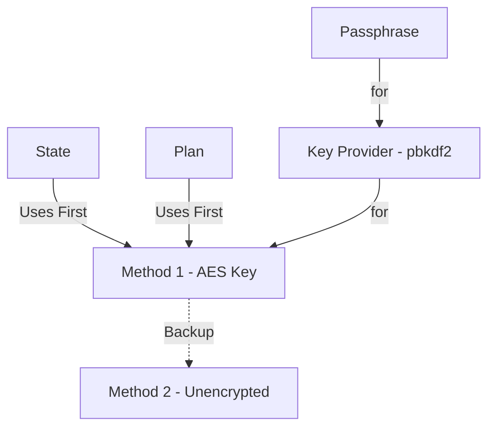

# tofu-exploration

An example of using [opentofu](https://opentofu.org/)'s latest 1.9 release features including;

- Encrypted State
- Provider iteration

The result of this will be a set of 2 local kind kubernetes clusters along with localized/encrypted state suitable for storing in git.

# Requirements

To use this project, you need to have the following requirements met:

1. **Mise**: Ensure you have [mise](https://mise.jdx.dev/) activated in your terminal. Mise is a tool that helps manage your development environment on a per-folder basis. This is incredibly useful for polyglot coding like this particular example. I find it to be less overhead than devcontainers. It does not replace virtual environments but can augment your use of them. It als replaces direnv for automatic loading of variables and secrets and more.

2. Docker/containerd

3. Linux/osx

**NOTE** Make sure to have mise activated before running the script to avoid any issues.

# Using

**configure.sh**: Run the `configure.sh` script to set up your environment. This script will configure necessary dependencies and settings for the project.

```sh
./configure.sh
# Use this for further tasks if not already in your profile
eval "$(mise activate bash)"
```

Run `task` at any time to see a list of additional tasks. For this example most tasks are at the root `Taskfile.yml` manifest.

To deploy run `task deploy:all`

To destroy run `task destroy:all`

## About

There are two branches so you can better diff the changes between the terraform version of this code vs. the updated tofu version.

**main** - terraform based deployment
**tofu** - tofu based deployment (go to this branch for tofu related notes and tasks)

# Terraform

**BRANCH**: main

The `main` branch includes terraform manifests for deploying 2 kind clusters side by side. The state is stored for each component as separate terraform state files in the `./secrets` folder. This folder is then targeted with `sops` to encrypt contents within.

To run through the multiple terraform states I could have used workspaces. But it was simpler to just target another file locally and use taskfile tricks to do multiple stacks in a row.

```bash
# Bring cluster1 and cluster2 up
task deploy:all

# Here you should review secrets and other state stuff in ./secrets.
# Don't commit this to git yet!
```

After this has completed you should have a handful of files in the local `./secrets` folder including:

- Kubernetes configuration files with full rights to your created clusters
- Additional per-cluster public and private keys
- Infrastructure and per-cluster state files with all applied terraform (including the generated ssh private keys and other sensitive information)

## Encrypting Local State

Both plan and state files are inherently plain text. We can encrypt the state files easily enough though. To start you will need some private key that is kept locally. I've chosen age keys with [sops](https://github.com/getsops/sops). You could use PGP or anything that sops supports.

```bash
task | grep sops # Show a list of our convenience tasks
task sops:show # Show all the variables setup for the tasks

task sops:age:keygen # Generate a local age key
task sops:init # Initialize this project repo with your public age key
task encrypt:all # Encrypt every file in the ./secrets folder
```

You can now review the secrets files and see that they have all been encrypted. Binary looking files like ssh keys will be converted to json format with the information required to decrypt them baked into the metadata (obviously minus our private age key)

With the age private key in `~/.config/sops/age/keys.txt` and all secrets files encrypted you can now commit changes safely. When you need to decrypt and run terraform operations again:

```bash
task decrypt:all
```

> **NOTE** You can and should use pre-commit hooks to prevent accidentally committing your secrets!

## Issues

If we ignore entirely that state stored like this inherently has zero concurrency, there are still other issues to contend with including:

1. **Concurrency Issues**: Terraform state files stored in git do not support concurrent operations. Multiple users or automated processes attempting to modify the state simultaneously can lead to conflicts and state corruption.

2. **Access Control**: Managing access to the encrypted state files can be challenging. Ensuring that only authorized users have access to the decryption keys and the ability to modify the state requires careful key management and access control policies.

3. **Key Management**: The security of the encrypted state files relies heavily on the management of encryption keys. Losing the keys or having them compromised can result in the inability to decrypt the state files or unauthorized access to sensitive information.

4. **Complexity**: Encrypting and decrypting state files adds an additional layer of complexity to the workflow. Users need to be familiar with the encryption tools and processes, which can increase the learning curve and potential for errors.

5. **Performance**: Encrypting and decrypting state files can introduce performance overhead, especially for large state files or when frequent operations are required. This can slow down the overall workflow and impact productivity.

6. **Backup and Recovery**: Ensuring that encrypted state files are properly backed up and can be recovered in case of data loss is crucial. This requires additional planning and processes to ensure that backups are secure and accessible when needed.

7. **Auditability**: Tracking changes to the state files and understanding the history of modifications can be more difficult when the files are encrypted. This can impact the ability to audit changes and troubleshoot issues effectively.

> **NOTE** There are some ways around the key management with external systems like Vault or Azure Key Vault.

## Clean Up

To remove the clusters and clean up your work.

```bash
# Tear them down
task destroy:all
```

# Opentofu

**BRANCH**: tofu-encryption

This is the same deployment using opentofu's encrypted state and provider iteration. Big update is that we are changing the binary used in our main `Taskfile.yml` definition.

I did try to use the VSCode plugin for OpenTofu but it was not very helpful for the more recent features (like the encryption block).

## State/Plan Encryption

As [per the docs](https://opentofu.org/docs/language/state/encryption/) we can encrypt state and plan data natively with opentofu.

This can be enabled via the `TF_ENCRYPTION` environment variable or in the terraform block. The way this works is that you define a `method` which can optionally contain key providers or other configuration for encryption. The key providers and methods available are not so large currently but it is still enough to get along.

> **Vault Transit Support** is not available if vault is running beyond 1.14 (the license change). It is experimental for openbao otherwise.

Anyway, the methods are assigned to the `state` and/or `plan` terraform definitions as either the primary or backup encryption types.



You can infer that your entry point for secret zero in a local file based state encryption will be that passphrase. We need to use something greater than 16 characters and private. The age private key can be used for this easily enough by setting the `TF_VAR_state_passphrase` variable I setup just for this purpose in the variables for these deployments.

**Important!** Ensure you have your local age key pair created with `task sops:age:keygen` (existing key will always be preserved).

With this in place I updated the local `Taskfile.yml` manifest to automatically source the private key value into that environment variable so it could be in place for encryption and added the relevant terraform.encryption block and variables for each terraform stack we are targeting.

If we run the deployment with no further changes then it automatically encrypts the terraform state files when we deploy via `task deploy:all`.

This does **not** encrypt any of the generated files we dump into that folder!

Specifically the argo git ssh keys and the kubernetes configuration files are not covered in this case. But we have that data from our state so we simply start ignoring them via `.gitignore` knowing we can always recreate them later via the encrypted state and `task deploy:all`.

> **Interesting:** Because the kind provider I used doesn't track the local config file resource when you create the cluster using that attribute I needed to make minor changes to isolate the kubeconfig files to their own generated file resources instead.

If everything is working as expected for your terraform deployment locally you should be able to push it up to your repo as-is and then pull it down later from any machine with the same age key and it should allow you to process tofu commands against it while still keeping all of its written contents entirely encrypted.

# Tips

- This builds two kube clusters then drops private keys and kube config locally in ~~a .gitignore defined~~ the `./secrets` path. You can use this to your advantage and target that folder with sops to encrypt things per cluster with just a wee bit more work ;)

- You can use [OpenLens](https://github.com/MuhammedKalkan/OpenLens) to explore your local cluster by pointing it at the kube config file.

- Most everything can be configured in the `Taskfile.yml` file, including if you'd like to use tofu or terraform. Fun for testing some of the new tofu features out as shown here.

- If `task deploy:all` fails try `task deploy`. If that fails try removing the clusters `kind delete cluster -n cluster1; kind delete cluster -n cluster2`
